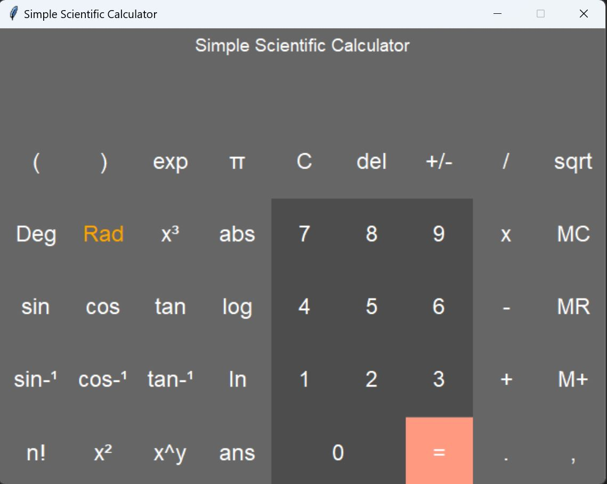

# INTRODUCTION
Using the Python programming language and the
Tkinter GUI module, we are creating a scientific calculator that the user
can simply use. This calculator has functions like add, sub, div, mul, cos,
roots, and others. Tkinter helps to create an interface that can be
operated with buttons. We can solve any mathematical problem by using
the Arithmetic-Logic Unit (ALU), which has all the mathematical functions.
# OBJECTIVES
1.Scientific calculators can be applied generally to solve fractional, root,
and operation-related questions. When a situation calls for several stages
to be taken, this kind of calculator is helpful.  
2.A scientific calculator can be used to answer arithmetic issues involving
algebraic expressions, other sorts of functions, operations with
polynomials and fractions, square roots, and other forms of roots.  
3.Problems involving logarithms, trigonometric equations, and exponential
functions can be solved with these calculators.
# DESIGN

    

  

# FLOWCHART

    

# FUNCTIONS USED
<b>Addition</b> :- Using the keyboard or the "+" button,
you can do addition (the "sum" function). As a result, a+b is produced.  
<b>Subtraction</b> :- By using the "-" button or using the keyboard, you can use
the subtraction (minus) function.
A-b is the output of the function.  

<b>Multiplication</b> :- The multiplication (times function) is accessed by
clicking the "*" button or pressing the "*" key on the keyboard. a*b is the
result of the function.  
 <b>Division</b> :-The division (divide function) is accessed by either clicking
the "/" button or pressing the "/" key on the keyboard. a/b is the result of
the function.  
<b>Sign</b> :- To utilise the sign key (negative key), click the "(-)" button. The
function yields a value of -1*x. Square :- You can use the square function
by typing "2" or by selecting the "x2" button. The function yields the value
x*x.  
<b>Square Root</b> :- You can use the square root function by pressing the "x"
button or by typing "sqrt()". This function reflects the condition x.5 where
the squared result equals x.  
 <b>Elevate the Power</b> :- You can utilise the raise to the power (y raised to the
x function) by typing "" or clicking the "yx" button.  

<b>Natural Exponential</b>:- Utilize the "ex" button or enter "exp()" to use
the natural exponential (e raised to the x). E (2.71828...) increased to x is
the outcome.   
<b>Logarithm</b> :- You can use the logarithm (LOG) by typing "LOG()" or by
clicking the "LOG" button. Natural Logarithm :- You can use the Natural
Logarithm (LN) by typing "LN()" or by selecting the "LN" button.
Inverse:- You can use the multiplicative inverse (reciprocal function) by
selecting "1/x" or by typing "inv()." This function is equivalent to
multiplying the number by 1 or x-1.  
<b>Exponential</b> :- Exponents of 10 are represented by numbers with a "e,"
such as 4.5e+100 or 4.5e-100. In this function, 10x is represented. When
a number is too big or too small for the display, it is automatically
presented in the format. The exponent key "EEX" should be used to input
a number in this format. Enter the mantissa (the portion without
containing an exponent) first, then hit "EEX" or type "e," and then enter
the exponent.  
<b>Factorial</b> :- You can utilise the Factorial function by typing "!" or by
clicking the "!" button.   
<b>PI :- PI is a mathematical constant of the ratio of a circle's circumference
to its diameter. 

